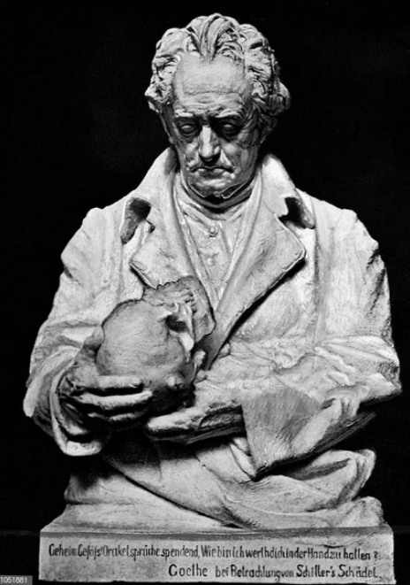

# Inspiration

Johann Wolfgang von Goethe hatte Schillers Schädel. Im September 1826 ließ sich Goethe den vermeintlichen Schädel seines verstorbenen Freundes Friedrich Schiller aus der Gruft bringen, untersuchte ihn und bewahrte ihn fast ein Jahr lang auf einem blauen Samtkissen in seinem Arbeitszimmer auf. Er inspirierte Goethe zu dem Gedicht "Bei Betrachtung von Schillers Schädel".

Der Schädel wurde später wieder mit den anderen Gebeinen Schillers in der Weimarer Fürstengruft vereint, obwohl es sich nicht um den echten Kopf handelte.

2008 fand man heraus (durch DNA probe) das keine der gebeine schillers wirklich ihm gehörten.

---

## Links
https://de.wikipedia.org/wiki/Dornburg_(Hessen)
https://de.wikipedia.org/wiki/Bei_Betrachtung_von_Schillers_Sch%C3%A4del
https://www.weimar-lese.de/streifzuege/geschichtliches/das-geheimnis-um-schillers-schaedel/ 

## Bei Betrachtung von Schillers Schädel
Johann Wolfgang von Goethe

> “Im ernsten Beinhaus wars, wo ich beschaute,
Wie Schädel Schädeln angeordnet paßten;
Die alte Zeit gedacht ich, die ergraute.
Sie stehn in Reih geklemmt, die sonst sich haßten,
Und derbe Knochen, die sich tödlich schlugen,
Sie liegen kreuzweis, zahm allhier zu rasten.
Entrenkte Schulterblätter! was sie trugen,
Fragt niemand mehr, und zierlich tätge Glieder,
Die Hand, der Fuß, zerstreut aus Lebensfugen.
Ihr Müden also lagt vergebens nieder,
Nicht Ruh im Grabe ließ man euch, vertrieben
Seid ihr herauf zum lichten Tage wieder,
Und niemand kann die dürre Schale lieben,
Welch herrlich edlen Kern sie auch bewahrte,
Doch mir Adepten war die Schrift geschrieben,
Die heilgen Sinn nicht jedem offenbarte,
Als ich inmitten solcher starren Menge
Unschätzbar herrlich ein Gebild gewahrte,
Daß in des Raumes Moderkält und Enge
Ich frei und wärmefühlend mich erquickte,
Als ob ein Lebensquell dem Tod entspränge,
Wie mich geheimnisvoll die Form entzückte!
Die gottgedachte Spur, die sich erhalten!
Ein Blick, der mich an jenes Meer entrückte,
Das flutend strömt gesteigerte Gestalten.
Geheim Gefäß! Orakelsprüche spendend,
Wie bin ich wert, dich in der Hand zu halten?
Dich höchsten Schatz aus Moder fromm entwendend
Und in die freie Luft, zu freiem Sinnen,
Zum Sonnenlicht andächtig hin mich wendend.
Was kann der Mensch im Leben mehr gewinnen,
Als daß sich Gott-Natur ihm offenbare?
Wie sie das Feste läßt zu Geist verrinnen,
Wie sie das Geisterzeugte fest bewahre.”

## Time line was passiert ist

* Schiller starb 1805
* ohne großes Aufsehen im Gewölbe der Weimarer Landeskasse auf dem Jakobsfriedhof beigesetzt
* 1824 -> kein platz mehr im grab
* Schiller-Sarg zu einem würdigeren Begräbnisort bewegen
  * Alles zu verfallen im grab
* Weimarer Bürgermeister Carl Leberecht Schwabe sucht selbst nach schillers überresten
  * Durch helfer 23 schädel bergen gelassen
  * Schädel werden anhand von form und mit vergleich zur totenmaske analysiert und bestimmt
  * Dabei fiel seine Wahl auf den wohlgeformtesten und am besten erhaltenen Schädel mit voller Bezahnung
  * Der rest der knochen gehört mehreren anderen menschen (später im grab)
* Die nun gefundenen überreste sollten beerdigt werden
* Der platz für das grab war allerding bereits für einen Großherzog bestimmt
  * Großherzog Karl August
* Diese äußerte seine bedenken und schlug vor schiller in einer Büste in der bibliothek zu verewigen
  * Wie es schon bei Philosophen Gottfried Wilhelm Leibniz geschah
* Am 17. September 1826 wurde „Schillers Schädel“ in besagter büste ausgestellt
  * anlässlich dichtete Göthe das gedicht: “Bei Betrachtung von Schillers Schädel” vor
* Der schlüssel zu schillers schädel wurde Ghoethe gegeben
* Schon in der nacht vom 25. auf den 26. September 1826 stahl er den schädel und versteckte ihn bei sich zuhause
* Gothe nutzte von da an den schädel als inspiration
* Goethe wurde neben den falsch zu sortierten gebeinen schillers begraben
* 2005 konnte man belegen das schiller nicht in seinem grab lag. Es waren die gebeine drei anderer personen

